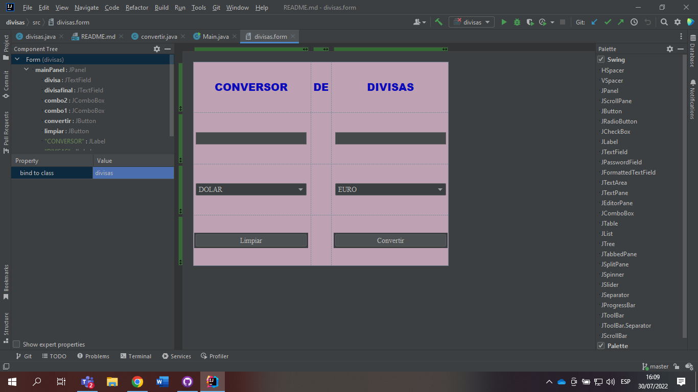
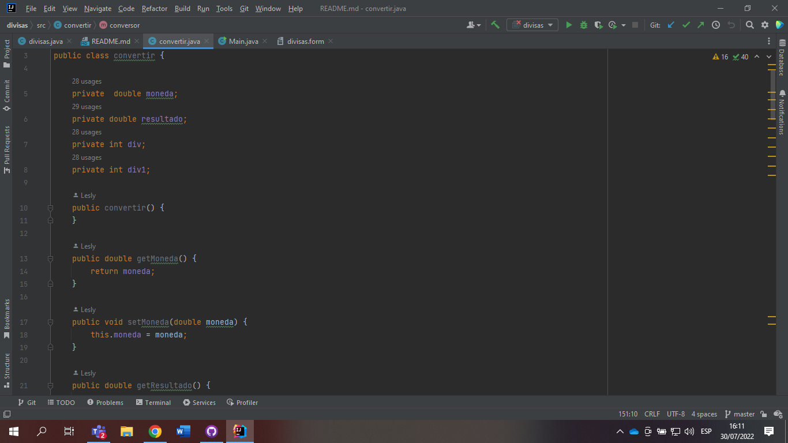
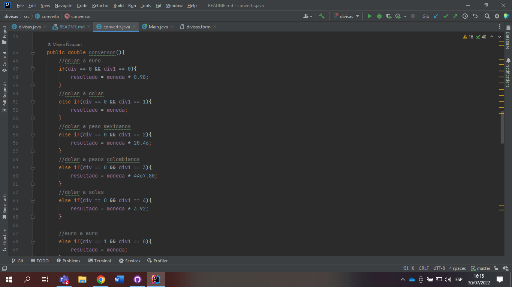
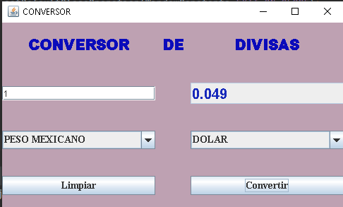
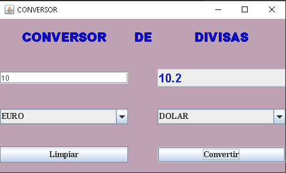

# Convertidor de divisar
* implementar el convertidor de divisas con 5 monedas, tanto de origen como de destino.

Integrantes:

Lesly Herrera

Nicole Motoche

Mayra Ñaupari

1. Formulario terminado

2. Código del constructor y setter y getter creados

3. Código de las diferentes converciones realizadas mediante if anidados
y utilzando las equivalencias de cada una de las monedas elejidas, cada if
cuenta con un comentario indicando las monedas que se estan transformando.

4.Colocamos sus medidas con el respectivo titulo

5. Colocamos los respectivos "create listener" del boton:convertir

6. Ejecución del programa 

